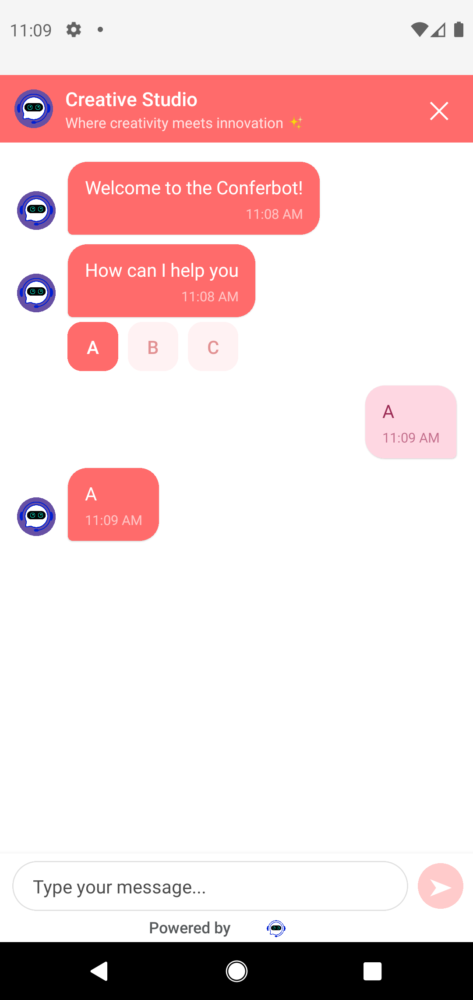

# Conferbot Android SDK

[](https://central.sonatype.com/artifact/com.conferbot/android-sdk)
[](https://developer.android.com)
[](https://kotlinlang.org)
[](LICENSE)

The official Android SDK for integrating [Conferbot](https://conferbot.com) into Kotlin and Java applications. Supports XML Views, Jetpack Compose, and headless (custom UI) patterns.

<p align="center">
  
  
  
</p>

## Features

- XML Views and Jetpack Compose with Material Design 3
- Real-time messaging over Socket.IO
- Offline message queueing with automatic retry
- Live agent handover with typing indicators
- File and image uploads
- Push notifications via FCM
- Automatic light/dark theme adaptation
- Full UI customization (colors, fonts, layout)
- Kotlin Coroutines and StateFlow for reactive state

## Requirements

- Android 5.0 (API 21) or higher
- Kotlin 1.9+
- Gradle 7.0+
- A Conferbot account with a valid API key

## Installation

Add the Maven Central repository (if not already present) and the SDK dependency.

**Project-level `build.gradle`:**

```gradle
allprojects {
    repositories {
        google()
        mavenCentral()
    }
}
```

**App-level `build.gradle`:**

```gradle
dependencies {
    implementation 'com.conferbot:android-sdk:1.0.0'
}
```

Sync your Gradle files after adding the dependency.

## Getting Your API Key and Bot ID

You need two credentials to use the SDK:

1. **Log in** to [Conferbot Dashboard](https://app.conferbot.com)
2. **Create or select a bot** from the dashboard
3. **Find your Bot ID**: Go to **Bot Settings** > **General** -- the Bot ID is displayed at the top
4. **Find your API Key**: Go to **Workspace Settings** > **API Keys** -- copy the key starting with `conf_`

## Quick Start

### Initialize the SDK

Call `Conferbot.initialize()` in your `Application` class:

```kotlin
import android.app.Application
import com.conferbot.sdk.core.Conferbot
import com.conferbot.sdk.models.ConferBotConfig

class MyApplication : Application() {
    override fun onCreate() {
        super.onCreate()

        Conferbot.initialize(
            context = this,
            apiKey = "YOUR_API_KEY",
            botId = "YOUR_BOT_ID",
            config = ConferBotConfig(
                enableNotifications = true,
                enableOfflineMode = true
            )
        )
    }
}
```

Register it in `AndroidManifest.xml`:

```xml
<application
    android:name=".MyApplication"
    ...>
</application>
```

### Pattern 1: Activity Launch

Open a full-screen chat Activity with a single call:

```kotlin
import com.conferbot.sdk.core.Conferbot

Conferbot.openChat(this)
```

### Pattern 2: Jetpack Compose

Embed the chat screen in any Composable:

```kotlin
import com.conferbot.sdk.ui.compose.ConferBotChatScreen

@Composable
fun SupportScreen() {
    var showChat by remember { mutableStateOf(false) }

    Button(onClick = { showChat = true }) {
        Text("Chat with us")
    }

    if (showChat) {
        ConferBotChatScreen(
            onDismiss = { showChat = false }
        )
    }
}
```

### Pattern 3: Floating Widget (FAB)

Overlay a floating chat button on top of your app. Tapping opens an animated chat bottom sheet. The widget reads server customizations automatically (color, icon, CTA text, position).

```kotlin
import com.conferbot.sdk.ui.compose.ConferBotWidget
import com.conferbot.sdk.ui.compose.ConferBotWidgetScope

// Option A: Overlay on any content
@Composable
fun MyApp() {
    ConferBotWidgetScope {
        // Your app content here
        MyMainScreen()
    }
}

// Option B: Place in a Box
@Composable
fun MyApp() {
    Box(Modifier.fillMaxSize()) {
        MyMainScreen()
        ConferBotWidget()
    }
}
```

### Pattern 4: Headless (Custom UI)

Build your own interface using the SDK's reactive state:

```kotlin
val messages by Conferbot.record.collectAsState()
val isConnected by Conferbot.isConnected.collectAsState()
val currentAgent by Conferbot.currentAgent.collectAsState()

LazyColumn {
    items(messages) { message ->
        CustomMessageBubble(message)
    }
}
```

Send messages programmatically:

```kotlin
Conferbot.sendMessage("Hello from my custom UI")
```

## Configuration

### ConferBotConfig

Pass a `ConferBotConfig` during initialization to control SDK behavior:

```kotlin
ConferBotConfig(
    enableNotifications = true,
    enableOfflineMode = true
)
```

| Parameter | Type | Default | Description |
|-----------|------|---------|-------------|
| `enableNotifications` | `Boolean` | `false` | Enable FCM push notifications |
| `enableOfflineMode` | `Boolean` | `false` | Queue messages while offline |

### ConferBotCustomization

Control the look and feel of the built-in chat UI:

```kotlin
import com.conferbot.sdk.models.ConferBotCustomization
import android.graphics.Color

Conferbot.initialize(
    context = this,
    apiKey = "YOUR_API_KEY",
    botId = "YOUR_BOT_ID",
    customization = ConferBotCustomization(
        primaryColor = Color.parseColor("#FF6B6B"),
        headerTitle = "Customer Support",
        enableAvatar = true,
        botBubbleColor = Color.parseColor("#0100EC"),
        userBubbleColor = Color.parseColor("#EDEDED")
    )
)
```

### User Identification

Attach user metadata to chat sessions for personalization and analytics:

```kotlin
import com.conferbot.sdk.models.ConferBotUser

Conferbot.identify(
    ConferBotUser(
        id = "user-123",
        name = "Jane Doe",
        email = "jane@example.com",
        phone = "+1234567890",
        metadata = mapOf(
            "plan" to "premium",
            "signupDate" to "2024-01-15"
        )
    )
)
```

## Theming

The SDK adapts to your app's Material Design 3 theme automatically. Override specific properties with `ConferBotCustomization`, or provide a full theme through the `ConferbotTheme` builder for granular control over colors, typography, and shape.

See [docs/COMPONENTS.md](docs/COMPONENTS.md) for the full list of themeable components.

## Push Notifications

Deliver agent responses when the app is in the background using Firebase Cloud Messaging.

1. Add the Firebase SDK to your project.
2. Pass the FCM token to Conferbot after initialization:

```kotlin
Conferbot.registerPushToken(fcmToken)
```

3. Forward incoming Conferbot payloads from your `FirebaseMessagingService`:

```kotlin
override fun onMessageReceived(message: RemoteMessage) {
    if (Conferbot.handlePushNotification(message.data)) return
    // Handle other notifications
}
```

## Offline Support

When `enableOfflineMode` is set to `true`, the SDK persists outgoing messages locally and delivers them once connectivity is restored. No additional code is required.

## Knowledge Base

If your bot is connected to a Conferbot Knowledge Base, responses are powered automatically. No SDK-side configuration is needed beyond providing the correct `botId`.

## Analytics

Chat events (session start, messages sent/received, agent handover) are tracked automatically when the SDK is initialized. Access analytics through the Conferbot dashboard.

## Event Handling

Listen for SDK events to integrate with your app's logic:

```kotlin
import com.conferbot.sdk.core.ConferBotEventListener

Conferbot.setEventListener(object : ConferBotEventListener {
    override fun onMessageReceived(message: RecordItem) { }
    override fun onAgentJoined(agent: Agent) { }
    override fun onSessionStarted(sessionId: String) { }
})
```

## State Management

All SDK state is exposed as Kotlin `StateFlow` properties:

| Property | Type | Description |
|----------|------|-------------|
| `isInitialized` | `StateFlow<Boolean>` | SDK initialization status |
| `isConnected` | `StateFlow<Boolean>` | Socket connection status |
| `chatSessionId` | `StateFlow<String?>` | Current session ID |
| `record` | `StateFlow<List<RecordItem>>` | Chat messages |
| `currentAgent` | `StateFlow<Agent?>` | Current live agent |
| `unreadCount` | `StateFlow<Int>` | Unread message count |
| `isAgentTyping` | `StateFlow<Boolean>` | Agent typing indicator |

Collect them from a coroutine scope or use `collectAsState()` in Compose.

## ProGuard

The SDK ships with consumer ProGuard rules. If you encounter issues with minified builds, add:

```proguard
-keep class com.conferbot.sdk.** { *; }
-keep class io.socket.** { *; }
```

## API Reference

Full API documentation is available in the [docs/](docs/) directory:

- [API.md](docs/API.md) -- Method and property reference
- [ARCHITECTURE.md](docs/ARCHITECTURE.md) -- SDK internals
- [COMPONENTS.md](docs/COMPONENTS.md) -- UI components
- [EXAMPLES.md](docs/EXAMPLES.md) -- Usage examples
- [CHANGELOG.md](docs/CHANGELOG.md) -- Version history

## Example App

A fully working sample app is included in the [`example/`](example/) directory.

### Running the Example

```bash
# 1. Clone the repo
git clone https://github.com/conferbot/android-sdk.git
cd android-sdk

# 2. Open in Android Studio
#    File > Open > select the root directory

# 3. Configure your bot credentials
#    Open example/src/main/java/com/conferbotexample/MainActivity.kt
#    Replace:
#      apiKey = "test_key"
#      botId = "YOUR_BOT_ID"
#    with your own credentials from the Conferbot dashboard.

# 4. Run the example app
#    Select the 'example' run configuration and click Run (or Shift+F10)
```

### What the Example Shows

| Activity | Pattern | Description |
|----------|---------|-------------|
| **MainActivity** | XML Views | Traditional Android UI with Conferbot XML components |
| **ComposeActivity** | Jetpack Compose | Modern declarative UI with Compose components |
| **Headless** | Custom UI | Full control using `Conferbot.state` StateFlow |

## Contributing

We welcome bug reports and feature requests via [GitHub Issues](https://github.com/conferbot/android-sdk/issues). If you would like to contribute code, please open an issue first to discuss the proposed change.

## License

Apache 2.0 -- see [LICENSE](LICENSE) for details.

## Resources

- [Full Documentation](https://docs.conferbot.com/mobile/android)
- [Conferbot Dashboard](https://app.conferbot.com)
- [GitHub Issues](https://github.com/conferbot/android-sdk/issues)
- Email: mobile-support@conferbot.com
