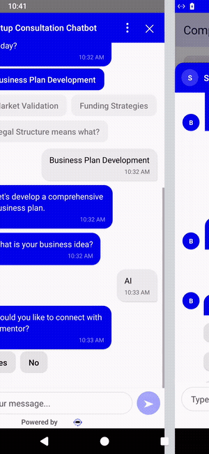
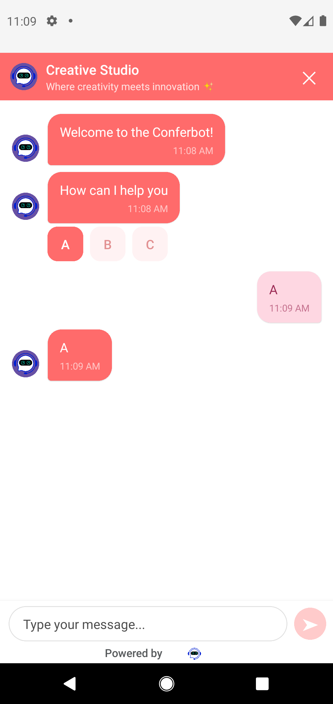
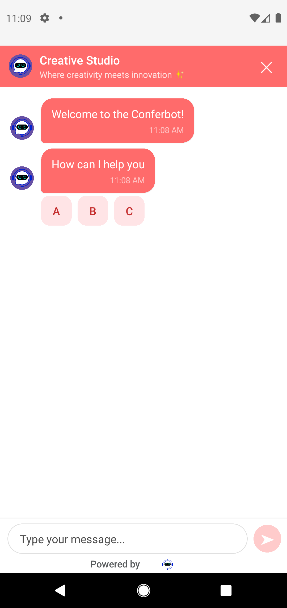

# Conferbot Android SDK

[](https://central.sonatype.com/artifact/com.conferbot/android-sdk)
[](https://developer.android.com)
[](https://kotlinlang.org)
[](LICENSE)

The official Android SDK for integrating [Conferbot](https://conferbot.com) into Kotlin and Java applications. Supports XML Views, Jetpack Compose, and headless (custom UI) patterns.

## See it in action

The complete flow recorded live on an Android emulator against production: open the floating widget, bot loads with server theming, welcome message with GIF, name captured through the input bar, choice selection with the transcript kept intact (selected chip stays highlighted, the rest disabled), and follow-up nodes.

<p align="center">
  
</p>

<p align="center"><a href="docs/demo.mp4">HD video (MP4)</a></p>

<p align="center">
  
  
  
</p>

## Features

- **Floating chat widget (FAB)** - the same bubble-in-the-corner experience as the Conferbot web widget, driven by your dashboard customizations
- **Drop-in chat UI** - full-screen Activity for XML apps, composables for Compose apps
- **Headless SDK** - every piece of state exposed as Kotlin `StateFlow` for fully custom UIs
- **Real-time messaging** - Socket.IO powered communication with the Conferbot flow engine
- **Server-driven theming** - colors, avatar, bot name, backgrounds, and widget placement configured in the dashboard apply automatically
- **Live agent handover** - transition to human agents with typing indicators
- **Offline support** - message queueing with automatic retry when connectivity returns
- **Session persistence** - chat history survives app restarts via Room
- **Message pagination** - efficient loading of large conversation histories
- **Push notifications** - FCM token registration, notification handling, and in-app banners
- **Knowledge base** - searchable help center screen with categories, articles, and ratings
- **File uploads** - image and file attachments with validation and progress
- **Analytics** - UTM attribution, interactions, goals, and CSAT/NPS ratings

## Requirements

| Requirement | Minimum |
|-------------|---------|
| Android     | 5.0 (API 21) |
| Kotlin      | 1.9 |
| Java        | 17 (SDK compiles with `jvmTarget 17`) |
| Compile SDK | 34 |

## Installation

Add the Maven Central repository (if not already present) and the SDK dependency. The published coordinates are `com.conferbot:android-sdk:1.0.0`.

**Settings or project-level `build.gradle`:**

```gradle
dependencyResolutionManagement {
    repositories {
        google()
        mavenCentral()
    }
}
```

**App-level `build.gradle`:**

```gradle
dependencies {
    implementation 'com.conferbot:android-sdk:1.0.0'
}
```

Or with Kotlin DSL:

```kotlin
dependencies {
    implementation("com.conferbot:android-sdk:1.0.0")
}
```

Sync your Gradle files after adding the dependency. To build against a local checkout instead, include the `:conferbot` module in your `settings.gradle`.

## Getting Your API Key and Bot ID

You need two credentials to use the SDK:

1. **Log in** to the [Conferbot Dashboard](https://app.conferbot.com)
2. **Create or select a bot** from the dashboard
3. **Find your Bot ID**: Go to **Bot Settings** > **General** - the Bot ID is displayed at the top
4. **API Key**: any placeholder works (e.g. `conf_test_key`); the bot ID is the credential

Just evaluating? The public demo bot ID `691c970890527a0468f9b2c9` works without a Conferbot account (any non-empty API key works, e.g. `conf_test_key`; the bot ID is the credential).

## Quick Start

### Initialize the SDK

Call `Conferbot.initialize()` once, in your `Application` class:

```kotlin
import android.app.Application
import com.conferbot.sdk.core.Conferbot
import com.conferbot.sdk.models.ConferBotConfig

class MyApplication : Application() {
    override fun onCreate() {
        super.onCreate()

        Conferbot.initialize(
            context = this,
            apiKey = "YOUR_API_KEY",
            botId = "YOUR_BOT_ID",
            config = ConferBotConfig(
                enableNotifications = true,
                enableOfflineMode = true
            )
        )
    }
}
```

Register it in `AndroidManifest.xml`:

```xml
<application
    android:name=".MyApplication"
    ...>
</application>
```

Note: `initialize()` throws `IllegalStateException` if called twice. Call `Conferbot.disconnect()` before re-initializing (for example with a different bot).

### Pattern 1: Activity Launch (XML apps)

Open a full-screen chat Activity with a single call:

```kotlin
import com.conferbot.sdk.core.Conferbot

Conferbot.openChat(this)
```

This creates a session if needed and launches the built-in `ChatActivity`.

### Pattern 2: Jetpack Compose

Embed the chat screen in any composable:

```kotlin
import androidx.compose.runtime.*
import com.conferbot.sdk.ui.compose.ConferBotChatScreen

@Composable
fun SupportScreen() {
    var showChat by remember { mutableStateOf(false) }

    Button(onClick = { showChat = true }) {
        Text("Chat with us")
    }

    if (showChat) {
        ConferBotChatScreen(
            onDismiss = { showChat = false }
        )
    }
}
```

### Pattern 3: Floating Widget (FAB)

The closest equivalent to the Conferbot web widget: a floating bubble in the bottom corner of the screen. Tapping it opens an animated bottom-sheet chat with a scrim; tapping again (or the scrim) closes it. The bubble shows an unread badge and an optional CTA tooltip, and reads server customizations automatically (color, icon, size, position, offsets, CTA text).

```kotlin
import com.conferbot.sdk.ui.compose.ConferBotWidget
import com.conferbot.sdk.ui.compose.ConferBotWidgetScope

// Option A: wrap your app content
@Composable
fun MyApp() {
    ConferBotWidgetScope {
        MyMainScreen()
    }
}

// Option B: place it yourself in a Box
@Composable
fun MyApp() {
    Box(Modifier.fillMaxSize()) {
        MyMainScreen()
        ConferBotWidget()
    }
}
```

Local fallback configuration (used only when the dashboard provides no value for that attribute):

```kotlin
import androidx.compose.ui.graphics.Color
import androidx.compose.ui.unit.dp
import com.conferbot.sdk.ui.compose.ConferBotWidgetConfig
import com.conferbot.sdk.ui.compose.WidgetPosition

ConferBotWidget(
    config = ConferBotWidgetConfig(
        position = WidgetPosition.BOTTOM_RIGHT,  // or BOTTOM_LEFT
        size = 50.dp,
        offsetX = 10.dp,
        offsetY = 10.dp,
        backgroundColor = Color(0xFF1B55F3),
        showUnreadBadge = true,
        borderRadius = null                      // null = fully circular
    )
)
```

Server values always win. Per attribute the resolution order is:

| Attribute | Resolution order |
|-----------|------------------|
| FAB color | `widgetIconBgColor` > `headerBgColor` > `config.backgroundColor` > default brand blue |
| Size | `widgetSize` > `config.size` |
| Position | `widgetPosition` ("left"/"right") > `config.position` |
| Horizontal offset | `widgetOffsetLeft`/`widgetOffsetRight` > `config.offsetX` |
| Vertical offset | `widgetOffsetBottom` > `config.offsetY` |
| Corner radius | `widgetBorderRadius` > `config.borderRadius` > size / 2 |
| Icon | `widgetIconSVG` (WidgetBubbleIcon1..15) > default bubble |
| CTA tooltip | `chatIconCtaText` (shown 2 s after mount, dismissed on tap or open) |

There is no XML-Views version of the floating bubble. In an XML app, host it in a `ComposeView`, or use `Conferbot.openChat()` from your own FAB.

### Pattern 4: Headless (Custom UI)

Build your own interface on top of the SDK's reactive state:

```kotlin
import androidx.compose.runtime.collectAsState
import com.conferbot.sdk.core.Conferbot

val messages by Conferbot.record.collectAsState()
val isConnected by Conferbot.isConnected.collectAsState()
val currentAgent by Conferbot.currentAgent.collectAsState()

LazyColumn {
    items(messages) { message ->
        CustomMessageBubble(message)
    }
}
```

Drive the conversation programmatically:

```kotlin
Conferbot.sendMessage("Hello from my custom UI")
Conferbot.sendTypingStatus(true)
Conferbot.initiateHandover(message = "I need help with billing")
Conferbot.endChat()
```

## Configuration

### ConferBotConfig

```kotlin
ConferBotConfig(
    enableNotifications = true,
    enableOfflineMode = true,
    autoConnect = true,
    reconnectionAttempts = 5,
    reconnectionDelay = 1000
)
```

| Parameter | Type | Default | Description |
|-----------|------|---------|-------------|
| `enableNotifications` | `Boolean` | `true` | Enable FCM push notification handling |
| `enableOfflineMode` | `Boolean` | `true` | Queue messages while offline |
| `autoConnect` | `Boolean` | `true` | Connect the socket automatically on initialize |
| `reconnectionAttempts` | `Int?` | `null` (5) | Max socket reconnection attempts |
| `reconnectionDelay` | `Int?` | `null` (1000 ms) | Delay between reconnection attempts |
| `aiSettings` | `AISettings` | `AISettings()` | Provider settings for GPT/LLM flow nodes |

### Endpoints and network tuning

The SDK talks to `https://wdt.conferbot.com` by default. Override per-install before `initialize()` (HTTPS only):

```kotlin
import com.conferbot.sdk.utils.ConferBotEndpoints
import com.conferbot.sdk.utils.ConferBotNetworkConfig

ConferBotEndpoints.setApiBaseUrl("https://your-proxy.example.com/api/v1/mobile/")
ConferBotEndpoints.setSocketUrl("https://your-proxy.example.com")

ConferBotNetworkConfig.configure(
    apiTimeout = 30_000L,
    socketTimeout = 20_000L,
    reconnectionAttempts = 5
)
```

You can also pass `baseUrl` and `socketUrl` directly to `Conferbot.initialize()`.

## Passing User Identity

Attach user details so conversations in the dashboard show who you are talking to. Pass the user at initialization, or call `identify()` before the first session is created:

```kotlin
import com.conferbot.sdk.models.ConferBotUser

Conferbot.identify(
    ConferBotUser(
        id = "user-123",
        name = "Jane Doe",
        email = "jane@example.com",
        phone = "+1234567890",
        metadata = mapOf(
            "plan" to "premium",
            "signupDate" to "2024-01-15"
        )
    )
)
```

The user ID is sent when the chat session is created (`initSession(userId = user?.id)`), so identify the user **before** the chat is opened. Calling `identify()` after a session exists updates the SDK's local user but does not retroactively re-tag the running session.

## Theming and Flow-Builder Customizations

### Server customizations apply automatically

Everything you configure in the dashboard's flow builder (**Customize** tab) is fetched with the bot data and applied by the SDK with no code: header and bubble colors, chat background (solid, gradient, or image), bot name, avatar, font size, bubble radius, branding/tagline, and all floating-widget settings.

**Precedence: server wins over local.** `ConferBotChatScreen` collects `Conferbot.serverTheme` and, whenever the server provides a `customizations` object, wraps the chat in that theme - even if you supplied your own theme via `ConferBotChatView` or `ConferbotThemeProvider`. Local themes therefore act as fallbacks that only apply when the bot has no server customizations. (For the FAB the same rule applies per attribute, see the table above.)

### Local themes (Compose)

For granular local control use the `ConferbotThemeBuilder`:

```kotlin
import androidx.compose.ui.graphics.Color
import androidx.compose.ui.unit.dp
import com.conferbot.sdk.ui.compose.ConferBotChatView
import com.conferbot.sdk.ui.theme.ConferbotThemeBuilder

val myTheme = ConferbotThemeBuilder.create()
    .name("Brand")
    .primaryColor(Color(0xFF6366F1))
    .headerColors(background = Color(0xFF6366F1), text = Color.White)
    .botBubbleColors(background = Color(0xFFF3F4F6), text = Color(0xFF111827))
    .userBubbleColors(background = Color(0xFF6366F1), text = Color.White)
    .bubbleRadius(16.dp)
    .build()

// Single theme
ConferBotChatView(theme = myTheme)

// Or light/dark pair following the system setting
ConferBotChatView(
    lightTheme = myTheme,
    darkTheme = DarkTheme,
    useDarkTheme = null  // null = follow system
)
```

The builder also exposes `secondaryColor`, `backgroundColor`, `surfaceColor`, `errorColor`, `agentBubbleColors`, `inputColors`, `fontFamily`, text sizes (`headerSize`, `bodySize`, `messageSize`, `captionSize`, `inputSize`, `buttonSize`), corner radii (`buttonRadius`, `cardRadius`, `inputRadius`, `imageRadius`), spacing, and animation durations.

### Local customization (XML ChatActivity)

The built-in XML `ChatActivity` (launched by `Conferbot.openChat()`) reads the `ConferBotCustomization` passed to `initialize()`:

```kotlin
import com.conferbot.sdk.models.ConferBotCustomization

Conferbot.initialize(
    context = this,
    apiKey = "YOUR_API_KEY",
    botId = "YOUR_BOT_ID",
    customization = ConferBotCustomization(
        primaryColor = ConferBotCustomization.parseColor("#FF6B6B"),
        headerTitle = "Customer Support",
        enableAvatar = true,
        botBubbleColor = ConferBotCustomization.parseColor("#0100EC"),
        userBubbleColor = ConferBotCustomization.parseColor("#EDEDED")
    )
)
```

`ConferBotCustomization` is used by the XML chat Activity only; the Compose UI is themed through `ConferbotTheme` and the server theme.

## Push Notifications

Deliver agent responses when the app is in the background using Firebase Cloud Messaging.

1. Add Firebase to your app (the SDK already depends on `firebase-messaging-ktx`; you need `google-services.json` and the `com.google.gms.google-services` plugin).
2. Register the FCM token after a session starts (token refreshes are forwarded automatically once notifications are initialized):

```kotlin
FirebaseMessaging.getInstance().token.addOnCompleteListener { task ->
    if (task.isSuccessful) {
        Conferbot.registerPushToken(task.result)
    }
}
```

3. Forward incoming payloads from your `FirebaseMessagingService`:

```kotlin
override fun onMessageReceived(message: RemoteMessage) {
    if (Conferbot.handlePushNotification(message.data)) return
    // Handle your own notifications
}
```

`handlePushNotification()` returns `true` only for Conferbot payloads, so your other notifications are untouched.

Additional controls: `unregisterPushToken()` (on logout), `handleNotificationTap(data)`, `setCurrentActivity(activity)` for in-app banners, `setNotificationChatActivity(MyChatActivity::class.java)` for custom deep links, `updateNotificationSettings(NotificationSettings)`, `addNotificationListener(listener)`, `cancelAllNotifications()`.

## Advanced

### Offline behavior

With `enableOfflineMode = true` (the default), outgoing messages are queued while the device is offline and synced automatically when connectivity returns. Observe and control the queue:

```kotlin
val isOnline by Conferbot.isOnline.collectAsState()
val pending by Conferbot.pendingMessageCount.collectAsState()
val syncing by Conferbot.isSyncingQueue.collectAsState()

Conferbot.processOfflineQueue()      // force a sync attempt
Conferbot.clearOfflineQueue()        // drop all queued messages
Conferbot.clearCurrentSessionQueue() // drop queued messages for this session
```

The built-in UI shows offline/connection/syncing banners automatically.

### Session persistence

Sessions and messages are persisted in a Room database. To resume a previous conversation instead of starting fresh:

```kotlin
if (Conferbot.hasPersistedSession()) {          // suspend fun
    val result = Conferbot.restorePersistedSession()  // suspend fun
    if (result.success) { /* history restored, room rejoined */ }
}
Conferbot.openChat(this)
```

`Conferbot.clearHistory()` wipes the local record and persisted session.

### Message pagination

Pass a `PaginationConfig` to `initialize()` to tune history loading:

```kotlin
Conferbot.initialize(
    context = this,
    apiKey = "...",
    botId = "...",
    paginationConfig = PaginationConfig(
        pageSize = 50,
        maxMemoryMessages = 100,
        backgroundMemoryLimit = 50,
        paginationThreshold = 10
    )
)
```

In headless UIs call `Conferbot.loadMoreMessages()` when the user scrolls near the top and check `Conferbot.hasMoreMessages()`. The built-in `ConferBotChatScreen` does this for you.

### Knowledge base

If your bot has a knowledge base, show the built-in help center:

```kotlin
import com.conferbot.sdk.ui.compose.knowledgebase.KnowledgeBaseScreen

val kbService = Conferbot.initKnowledgeBaseService() ?: return
Conferbot.fetchKnowledgeBase()

KnowledgeBaseScreen(
    knowledgeBaseService = kbService,
    onDismiss = { /* close */ },
    title = "Help Center"
)
```

Headless access: `Conferbot.searchKnowledgeBase(query)`, `trackKnowledgeBaseArticleView(article)`, `startKnowledgeBaseArticleEngagement(articleId)`, `updateKnowledgeBaseScrollDepth(depth)`, `rateKnowledgeBaseArticle(articleId, helpful)`, `hasRatedKnowledgeBaseArticle(articleId)`.

### Analytics

Chat lifecycle events are tracked automatically. Optional extras:

```kotlin
Conferbot.setUtmParameters(utmSource = "newsletter", utmCampaign = "spring")
Conferbot.trackInteraction("buttonsClicked", mapOf("id" to "pricing"))
Conferbot.trackGoalCompletion("goal-123", conversionValue = 49.0)
Conferbot.submitChatRating(csatScore = 5, feedback = "Great!")
```

### Raw socket events

Subscribe to any embed-server event by name (constants in `com.conferbot.sdk.models.SocketEvents`):

```kotlin
import com.conferbot.sdk.models.SocketEvents
import io.socket.emitter.Emitter

val listener = Emitter.Listener { args -> /* ... */ }
Conferbot.on(SocketEvents.BOT_RESPONSE, listener)
Conferbot.on(SocketEvents.AGENT_ACCEPTED, listener)
Conferbot.off(SocketEvents.BOT_RESPONSE, listener)
```

### Not available (yet)

Compared to other Conferbot SDKs, the Android SDK does **not** currently include voice message recording/playback (available in the Flutter SDK). File and image uploads are supported.

## Event Handling

Implement `ConferBotEventListener` (all methods have default no-op implementations, so override only what you need):

```kotlin
import com.conferbot.sdk.core.Conferbot
import com.conferbot.sdk.core.ConferBotEventListener
import com.conferbot.sdk.models.Agent
import com.conferbot.sdk.models.RecordItem

Conferbot.setEventListener(object : ConferBotEventListener {
    override fun onMessageReceived(message: RecordItem) { }
    override fun onMessageSent(message: RecordItem) { }
    override fun onAgentJoined(agent: Agent) { }
    override fun onAgentLeft(agent: Agent) { }
    override fun onSessionStarted(sessionId: String) { }
    override fun onSessionEnded(sessionId: String) { }
    override fun onTypingIndicator(isTyping: Boolean) { }
    override fun onUnreadCountChanged(count: Int) { }
    override fun onOnlineStatusChanged(isOnline: Boolean) { }
    override fun onMessageFailed(messageId: String) { }
    override fun onQueueSynced(successCount: Int, failCount: Int) { }
})
```

## State Management

All SDK state is exposed as `StateFlow` on the `Conferbot` singleton:

| Property | Type | Description |
|----------|------|-------------|
| `isInitialized` | `StateFlow<Boolean>` | SDK initialization status |
| `isConnected` | `StateFlow<Boolean>` | Socket connection status |
| `chatSessionId` | `StateFlow<String?>` | Current session ID |
| `record` | `StateFlow<List<RecordItem>>` | Chat messages |
| `currentAgent` | `StateFlow<Agent?>` | Current live agent |
| `unreadCount` | `StateFlow<Int>` | Unread message count |
| `isChatVisible` | `StateFlow<Boolean>` | Whether a chat UI is showing |
| `isAgentTyping` | `StateFlow<Boolean>` | Agent typing indicator |
| `isLiveChatMode` | `StateFlow<Boolean>` | Live agent mode active |
| `serverTheme` | `StateFlow<ConferbotTheme?>` | Theme built from dashboard customizations |
| `serverCustomization` | `StateFlow<ServerChatbotCustomization?>` | Raw dashboard customization values |
| `isOnline` | `StateFlow<Boolean>` | Device connectivity |
| `pendingMessageCount` | `StateFlow<Int>` | Queued offline messages |
| `isSyncingQueue` | `StateFlow<Boolean>` | Offline queue sync in progress |
| `paginationState` | `StateFlow<PaginationState>` | Message pagination state |
| `isLoadingMore` | `StateFlow<Boolean>` | Older messages loading |

Collect them from a coroutine scope, or use `collectAsState()` in Compose.

## API Reference

Core methods on `com.conferbot.sdk.core.Conferbot`:

| Member | Signature | Description |
|--------|-----------|-------------|
| `initialize` | `initialize(context: Context, apiKey: String, botId: String, config: ConferBotConfig = ConferBotConfig(), customization: ConferBotCustomization? = null, user: ConferBotUser? = null, baseUrl: String? = null, socketUrl: String? = null, paginationConfig: PaginationConfig = PaginationConfig())` | One-time SDK setup; throws if already initialized |
| `openChat` | `openChat(context: Context)` | Launch the built-in full-screen chat Activity |
| `initializeSession` | `suspend initializeSession(): Boolean` | Create a chat session manually (headless) |
| `sendMessage` | `sendMessage(text: String)` | Send a visitor message |
| `sendTypingStatus` | `sendTypingStatus(isTyping: Boolean)` | Report visitor typing state |
| `initiateHandover` | `initiateHandover(message: String? = null)` | Request a live agent |
| `endChat` | `endChat()` | End the current conversation |
| `identify` | `identify(user: ConferBotUser)` | Set the current user (before session creation) |
| `setEventListener` | `setEventListener(listener: ConferBotEventListener)` | Register the SDK event callback |
| `on` / `off` | `on(event: String, callback: Emitter.Listener)` / `off(event: String, callback: Emitter.Listener? = null)` | Raw socket event subscription |
| `loadMoreMessages` | `loadMoreMessages()` | Load the next page of history |
| `hasMoreMessages` | `hasMoreMessages(): Boolean` | Whether older messages exist |
| `hasPersistedSession` | `suspend hasPersistedSession(): Boolean` | A restorable session exists locally |
| `restorePersistedSession` | `suspend restorePersistedSession(): SessionRestoreResult` | Restore the persisted session |
| `clearHistory` | `clearHistory()` | Clear local messages and persisted session |
| `resetUnreadCount` | `resetUnreadCount()` | Zero the unread badge |
| `registerPushToken` | `registerPushToken(token: String)` | Register an FCM token |
| `unregisterPushToken` | `unregisterPushToken()` | Remove the registered token |
| `handlePushNotification` | `handlePushNotification(data: Map<String, String>): Boolean` | Route an FCM payload; true if handled |
| `handleNotificationTap` | `handleNotificationTap(data: Map<String, String>)` | Handle a notification tap intent |
| `updateNotificationSettings` | `updateNotificationSettings(settings: NotificationSettings)` | Configure notification behavior |
| `initKnowledgeBaseService` | `initKnowledgeBaseService(): KnowledgeBaseService?` | Get/create the KB service |
| `fetchKnowledgeBase` | `fetchKnowledgeBase()` | Request KB data over the socket |
| `searchKnowledgeBase` | `searchKnowledgeBase(query: String)` | Full-text article search |
| `setUtmParameters` | `setUtmParameters(utmSource: String? = null, utmMedium: String? = null, utmCampaign: String? = null, utmTerm: String? = null, utmContent: String? = null, referrer: String? = null, landingPage: String? = null)` | Attribution parameters |
| `trackGoalCompletion` | `trackGoalCompletion(goalId: String, conversionEvent: String? = null, conversionValue: Double? = null)` | Report a goal conversion |
| `submitChatRating` | `submitChatRating(csatScore: Int? = null, feedback: String? = null, thumbsUp: Boolean? = null, npsScore: Int? = null, source: String = "post_chat_survey")` | Submit CSAT/NPS feedback |
| `disconnect` | `disconnect()` | Tear down socket, state, and allow re-init |

UI entry points:

| Composable / Class | Signature | Description |
|--------------------|-----------|-------------|
| `ConferBotWidget` | `@Composable ConferBotWidget(config: ConferBotWidgetConfig = ConferBotWidgetConfig(), modifier: Modifier = Modifier)` | Floating chat bubble + bottom-sheet chat overlay |
| `ConferBotWidgetScope` | `@Composable ConferBotWidgetScope(config: ConferBotWidgetConfig = ConferBotWidgetConfig(), content: @Composable () -> Unit)` | Overlays the widget on top of your content |
| `ConferBotChatScreen` | `@Composable ConferBotChatScreen(onDismiss: () -> Unit = {}, modifier: Modifier = Modifier)` | Full chat screen (server-themed) |
| `ConferBotChatView` | `@Composable ConferBotChatView(modifier, lightTheme: ConferbotTheme = LightTheme, darkTheme: ConferbotTheme = DarkTheme, useDarkTheme: Boolean? = null, ...)` | Chat screen with local light/dark theming |
| `ConferBotThemedChatScreen` | `@Composable ConferBotThemedChatScreen(onDismiss: () -> Unit, lightTheme, darkTheme, useDarkTheme, modifier)` | Themed modal chat with dismiss |
| `KnowledgeBaseScreen` | `@Composable KnowledgeBaseScreen(knowledgeBaseService: KnowledgeBaseService, onDismiss: () -> Unit, modifier: Modifier = Modifier, primaryColor: Color = Color(0xFF0100EC), title: String = "Help Center")` | Built-in help center |
| `ChatActivity` | `com.conferbot.sdk.ui.views.ChatActivity` | XML full-screen chat (launched by `openChat`) |

More detail in the [docs/](docs/) directory: [USAGE.md](docs/USAGE.md) (step-by-step tutorial), [API.md](docs/API.md), [ARCHITECTURE.md](docs/ARCHITECTURE.md), [COMPONENTS.md](docs/COMPONENTS.md), [EXAMPLES.md](docs/EXAMPLES.md), [CHANGELOG.md](docs/CHANGELOG.md).

## Troubleshooting

**The bot does not appear / stays blank**

1. **Check the bot is published.** Draft flows are not served to the SDK - publish from the flow builder.
2. **Check the `botId`.** It must be the 24-character ID from Bot Settings > General. A wrong ID fails silently with an empty chat.
3. **Check connectivity to `wdt.conferbot.com`.** The SDK needs HTTPS access to `https://wdt.conferbot.com` (REST + Socket.IO). Corporate proxies or firewalls that block WebSockets will prevent messages from flowing.
4. **Try the demo bot.** Bot ID `691c970890527a0468f9b2c9` works without an account - if it loads, the problem is your bot's ID or publish state, not the integration.
5. **Watch Logcat.** Filter by tag `Conferbot` for initialization, session, and socket errors.

**`IllegalStateException: already initialized`** - `initialize()` was called twice. Initialize once in `Application.onCreate()`, and call `disconnect()` before re-initializing.

**Messages send but nothing comes back** - the socket may be connected while the flow failed to start; confirm the bot is published and check for `fetched-chatbot-data` errors in Logcat.

**Minified release builds crash** - the SDK ships consumer ProGuard rules; if you still hit issues add:

```proguard
-keep class com.conferbot.sdk.** { *; }
-keep class io.socket.** { *; }
```

## Example App

A fully working sample app is included in the [`example/`](example/) directory.

```bash
# 1. Clone the repo
git clone https://github.com/conferbot/android-sdk.git
cd android-sdk

# 2. Open in Android Studio
#    File > Open > select the root directory

# 3. Configure your bot credentials
#    Open example/src/main/java/com/conferbot/example/ExampleApplication.kt
#    and replace:
#      apiKey = "test_key"
#      botId  = "691c970890527a0468f9b2c9"   # public demo bot, works as-is
#    with your own credentials from the Conferbot dashboard.

# 4. Run the 'example' configuration on a device or emulator (Shift+F10)
```

### What the Example Shows

| Screen | Pattern | Description |
|--------|---------|-------------|
| **MainActivity** (XML) | Activity launch + headless | Buttons for `openChat`, `identify`, `sendMessage`, `initiateHandover`, `clearHistory`; observes `unreadCount`, `isConnected`, `currentAgent`, `record` |
| **ComposeActivity** | Jetpack Compose | Embeds `ConferBotChatScreen` in a Compose app |
| **ExampleApplication** | Setup | `initialize()`, event listener, notification listener/settings, FCM token registration |

## Contributing

We welcome bug reports and feature requests via [GitHub Issues](https://github.com/conferbot/android-sdk/issues). If you would like to contribute code, please open an issue first to discuss the proposed change.

## License

Apache 2.0 - see [LICENSE](LICENSE) for details.

## Resources

- [Full Documentation](https://docs.conferbot.com/mobile/android)
- [Conferbot Dashboard](https://app.conferbot.com)
- [GitHub Issues](https://github.com/conferbot/android-sdk/issues)
- Email: mobile-support@conferbot.com
